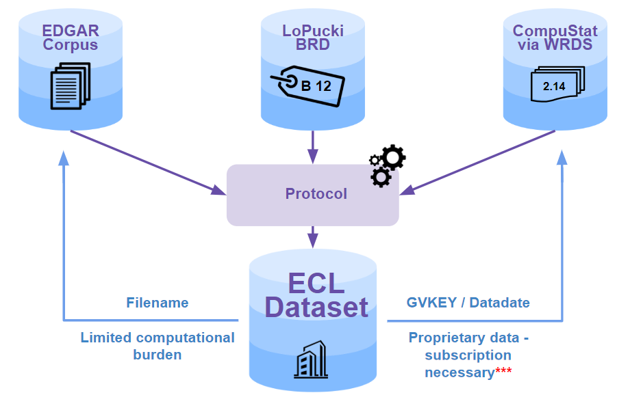

# The ECL Dataset 💸📜📈

### Introduction
Welcome to the ECL GitHub repository! This repository contains the resources that show how to use, update and experiment with the ECL dataset. The dataset contains the multimodal (numerical and textual) data contained in corporate 10-K filings, and associated binary bankruptcy labels. For more details on the dataset and the experiments, see:

```From Numbers to Words: Multi-Modal Bankruptcy Prediction Using the ECL Dataset (Arno et al., 2023)```

**Complete citation will follow soon**

### Data Sources
The ECL dataset is a unique compilation of three existing data sources: **the EDGAR-corpus, CompuStat, and the LoPucki Bankruptcy Research Database (BRD)**. (1) The EDGAR-corpus is used to collect the textual data from corporate 10K filings, (2) CompuStat serves as our data source for the numerical financial data as reported in the 10Ks, while (3) the LoPucki BRD supplies the labels for the bankruptcy prediction task. Note that CompuStat requires a paid subscription, **therefore it is necessary to have access to CompuStat (via either a WRDS account or a local CompuStat copy) if you want to access the numerical financial data. If you are only interested in the textual data, then you do not need access to CompuStat, and hence do not need a subscription.**

### Structure of the Dataset
The ECL dataset is as a single .csv file, where each row corresponds to a 10K filing. Such a filing is characterised by a company identifier (the *cik*, *gvkey*, or *company name*) and a date (the fiscal year end, corresponding to the *period_of_report* variable). When designing the dataset, we decided not to store the multimodal data in the ECL .csv file, but we opted to store pointers from a 10K record in ECL to the relevant records in the source datasets. This structure (1) allows users to extract the necessary variables easily with a limited computational burden and (2) ensures that we do not violate the terms of use of the proprietary CompuStat data.

- A 10K record in our dataset maps to a textual record in the EDGAR-corpus via the variable *filename*. This variable represents the relative path to the JSON file in the corpus, which contains the textual data from the 10K filing.
- A 10K record in our dataset maps to a record in the CompuStat dataset via the *gvkey* and *datadate* variables. These keys uniquely identify a record in CompuStat which contains the numerical financial data from the 10K filing.
- All the relevant variables for the bankruptcy prediction task are included in our dataset and do not need to be extracted from the LoPucki BRD.

**Schematically:**




You can access the ECL .csv file and the EDGAR-corpus (our updated version) at:

```... pointers to the datasets will follow soon ...```


### Purpose of this Repository
The purpose of this GitHub repository is to demonstrate the usage of the ECL dataset, with a particular focus on the main use case: next-year bankruptcy prediction. By utilizing the labels derived from the LoPucki BRD, we aim to develop models and techniques that can effectively predict bankruptcy based on the multimodal data contained in the 10K reports. We argue that the ECL dataset can also be used for other applications, not explored in this repository, such as investment decision making, financial risk management, ... and so on. 

In addition to providing code examples that showcase the utilization of the dataset, we also offer code for updating the dataset. This feature allows users to incorporate the most recent 10K filings in the dataset, ensuring that the analyses is based on the most up-to-date information available. The released version of the dataset contains information untill May 2023, bankruptcy labels are only available untill the end of 2022 and will not be updated.

### Repository Contents
**Data Exploration Demo:** A Jupyter notebook that demonstrate how to load and explore the ECL dataset, providing insights into the multimodal nature of the data and the potential applications.

**Next-Year Bankruptcy Prediction folder:** A set of Jupyter notebooks containing the bankruptcy prediction experiments presented in the paper using the ECL dataset. We exploit various machine learning and deep learning techniques that serve as baseline models and a basis for future research.

**Dataset Update Code:** In the /update folder, you can find a Jupyter notebook (Dataset Update Code) for updating the ECL dataset with the most recent 10K filings from public companies. These resources enable users to keep their analyses in sync with the latest financial information. In this part of the repository we make use of EDGAR-crawler, an open-source GitHub repository that allows us to crawl and parse the textual data, which is added as a submodule (see below).

### Getting Started - Windows
To get started, we suggest to clone the repository to your local machine. Then you can install some (minimal) necessary dependencies via the **env.yml** file.  Note that the dependencies in the env.yml file are not sufficient to run the code in this repository, you might need to install additional dependencies! Finally, you must add the edgar-crawler GitHub repository as a submodule to the update folder. You can do all of this by running the following commands if you are working on a Windows machine (from the location where you wish to store the code).

```
:: Navigate to the desired location to store the code and clone the repository
git clone git@github.com:henriarnoUG/ECL.git
```

```
:: Move into the GitHub repository
cd ECL

:: Create a new conda environment from requirements.txt file
conda env create -f env.yml

:: Activate the conda environment
conda activate ECL
```

```
:: Add the edgar-crawler GitHub repository as a submodule to the update folder
git submodule update --init --recursive

```

We encourage collaboration and welcome contributions to enhance the dataset and expand the range of applications. Together, we can leverage multimodal financial data to gain valuable insights into the financial health and stability of public companies.

### Citation
If you use the ECL dataset or code from this repository in your research or projects, please consider citing it as:

```From Numbers to Words: Multi-Modal Bankruptcy Prediction Using the ECL Dataset (Arno et al., 2023)```

**Complete citation will follow soon**

### References

```For the complete reference list, see the paper mentioned above```

- *EDGAR-CORPUS Dataset:* https://zenodo.org/record/5528490
- *Lopucki Bankruptcy Research Database:* https://lopucki.law.ufl.edu/index.php
- *S&P CompuStat Database*: http://www.compustat.com 

We hope that the ECL dataset and the provided code will be valuable resources for researchers, practitioners, and enthusiasts in the field of finance or machine learning.
